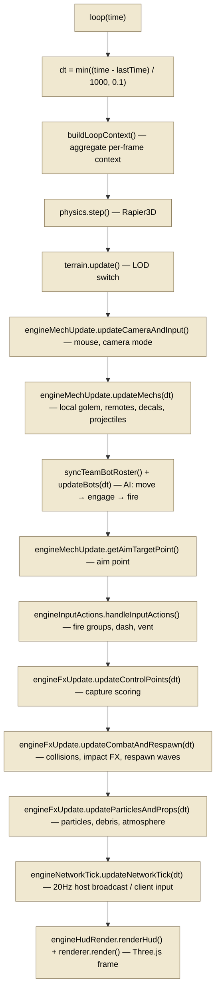
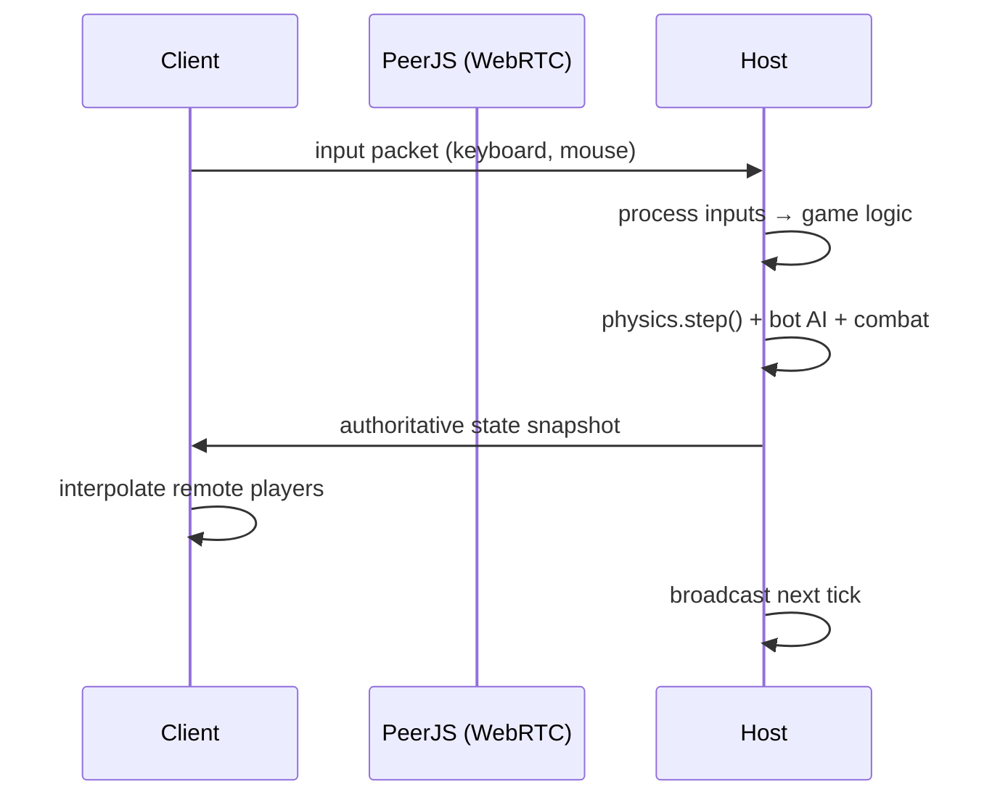

# Architecture & Subsystem Map

> Auto-generated reference for LLM context. Shows dependencies, data flow, and update order.

## Subsystem Overview

```
src/
├── app/                          # React hooks, session management, pilot accounts (8 files, ~1100 lines)
│   ├── appHelpers.ts             # copyText, getStartupFailureMessage, releasePointerLock
│   ├── useAppSettings.ts         # Settings state + localStorage sync
│   ├── useHudWarning.ts          # computeHudWarning, computeHudRatios
│   ├── useGameSession.ts         # Main game session orchestration
│   ├── useFirebaseLobbyRooms.ts  # Firebase lobby hooks
│   └── usePilotAccount.ts        # Pilot account + Supabase auth
├── core/                         # Game engine core — pure functions + adapters (~50 files, ~7700 lines)
│   ├── engineInit.ts             # Subsystem construction (renderer, physics, world, ...)
│   ├── engineSpawn.ts            # getTeamSpawns, getSpawnYaw, placeGolemAtSpawn
│   ├── engineBotManagement.ts    # createBot, destroyBot
│   ├── engineMechUpdate.ts       # updateMechs, updateCameraAndInput, getAimTargetPoint
│   ├── engineNetworkTick.ts      # 20Hz snapshot broadcast (NETWORK_TICK_INTERVAL=0.05)
│   ├── engineHudRender.ts        # renderHud with buildGameHudState
│   ├── engineInputActions.ts     # handleInputActions (fire/dash/vent)
│   ├── engineFxUpdate.ts         # updateCombatAndRespawn, updateControlPoints, particles
│   ├── engineContexts.ts         # getUnitLocatorContext, getBotObjectiveContext
│   ├── engineNetworkSetup.ts     # setupNetworkHandlers
│   ├── engineAdapterFactory.ts   # buildSessionAdapters, buildRuntimeAdapters
│   ├── engineLoopContext.ts      # buildLoopContext (per-frame context aggregation)
│   ├── engineRestartMatch.ts     # restartMatch (host/client gate)
│   ├── Engine.ts                 # class Game — orchestrator (~511 lines)
│   ├── bots/                     # Bot AI, movement targets, snapshots (2 files)
│   ├── combat/                   # Projectile hit logic, FX, combat rules (4 files)
│   ├── match/                    # Scoring, game mode settings, team overview (2 files)
│   ├── network/                  # Network sync, message runtime, remote players (7 files)
│   ├── respawn/                  # Respawn waves, spawn points, death tracking (3 files)
│   ├── runtimeSmoke/             # Smoke tests + per-test files (10 files)
│   │   ├── runRuntimeSmoke.ts    # Orchestrator (15 lines)
│   │   ├── smokeHelpers.ts       # createFakeGolem, createFakeBot, assert, runTest
│   │   └── tests/                # 6 test files: testNetworkDispatcher, testRespawn, testPlayerHit, testAuthoritativeState, testRemoteFire, testBotRoster
│   └── world/                    # World FX runtime (1 file)
├── entities/                     # Golem controllers, DummyBot, factory (7 files, ~1900 lines)
│   ├── GolemController.ts        # Player mech orchestrator (~311 lines)
│   ├── golemUpdate.ts            # Per-frame update logic (~171 lines)
│   ├── GolemFactory.ts           # Procedural mesh creation
│   ├── DummyBot.ts               # AI bot controller
│   ├── KWIIRuntimeAsset.ts       # Hero visual loader
│   └── GolemControllerTypes.ts   # Shared types
├── world/                        # Arena, terrain, trees, grass, props (~22 files, ~4900 lines)
│   ├── Arena.ts                  # Arena orchestrator (~116 lines)
│   ├── arenaBase.ts              # Team bases, walls, combat cover
│   ├── arenaColliders.ts         # Box/cylinder collider helpers
│   ├── arenaLandmarks.ts         # Route landmarks, lane markers
│   ├── arenaLaneNodes.ts         # Lane node positions for bot AI
│   ├── arenaStructures.ts        # Steam yard, ruin quarter, rock arch, pressure tower
│   ├── BreakableStructureManager.ts  # Damage/destroy orchestration
│   ├── houseTemplates.ts         # GLTF/texture/material loaders
│   ├── proceduralHouse.ts        # Procedural house construction
│   ├── sectionedHouse.ts         # Sectioned houses + body creation
│   ├── houseLifecycle.ts         # Proxy management
│   ├── sectionPhysics.ts         # Section damage/collapse/falling
│   ├── propShared.ts             # Shared prop types
│   ├── TerrainBuilder.ts         # Heightfield, materials, LOD
│   ├── TreeSpawner.ts            # 20 tree types via InstancedMesh
│   ├── GroundCoverSpawner.ts     # 13 bush/flower types via InstancedMesh
│   ├── GrassShaderSystem.ts      # 60k procedural grass blades (vertex shader)
│   ├── WorldPropSystem.ts        # Prop registry + state
│   └── HeightmapSource.ts        # ImageHeightmap + procedural fallback
├── mechs/                        # Chassis definitions, loadouts, rules, runtime (16 files, ~2126 lines)
├── combat/                       # Weapon definitions, profiles, projectile types (3 files, ~548 lines)
├── gameplay/                     # Control points, game mode types (5 files, ~640 lines)
│   ├── ControlPointManager.ts    # Orchestrator (~133 lines)
│   ├── controlPointMeshes.ts     # Mesh creation (outer ring, fill, beacon, banners, label)
│   ├── controlPointVisuals.ts    # Visual updates + label sprite, progress geometry
│   └── types.ts                  # Shared gameplay types
├── network/                      # NetworkManager (PeerJS wrapper) (1 file, ~157 lines)
├── camera/                       # Third-person + orbit camera (1 file, ~299 lines)
├── fx/                           # Debris, particles, impact effects (4 files, ~659 lines)
├── ui/                           # React components: lobby, HUD (6 files, ~431 lines)
├── i18n/                         # Localization: en, ru, key maps (5 files, ~653 lines)
├── supabase/                     # Auth, profile, progression (7 files, ~561 lines)
├── firebase/                     # Lobby registry, rooms (2 files, ~287 lines)
├── utils/                        # Quality profiles, helpers (3 files, ~155 lines)
└── assets/                       # Asset loaders (GLTF, textures) (0 files)
```

## File Size Limit

All source files are capped at **400 lines** (`npm run test:file-sizes` enforces this). Large files are split into focused modules following the **runtime + adapter context** pattern — see `Engine.ts` for the canonical example of how a class orchestrator delegates per-frame logic to pure runtime functions in `src/core/`.

### Engine.ts Module Splits

| Module | Purpose | Lines |
|--------|---------|-------|
| `engineInit.ts` | Subsystem construction (renderer, physics, world, projectiles) | 95 |
| `engineSpawn.ts` | Team spawns, spawn yaw, placeGolemAtSpawn | 79 |
| `engineBotManagement.ts` | Bot create/destroy with BotSpawnContext | 51 |
| `engineMechUpdate.ts` | Mech update, camera/input, aim target | 113 |
| `engineNetworkTick.ts` | 20Hz snapshot broadcast (NETWORK_TICK_INTERVAL=0.05) | 124 |
| `engineHudRender.ts` | HUD state + radar + team overview | 100 |
| `engineInputActions.ts` | Fire groups, dash, vent | 75 |
| `engineFxUpdate.ts` | Combat/respawn/control points/particles | 80 |
| `engineContexts.ts` | getUnitLocatorContext, getBotObjectiveContext | 50 |
| `engineNetworkSetup.ts` | WebRTC message handlers | 60 |
| `engineAdapterFactory.ts` | buildSessionAdapters, buildRuntimeAdapters | 50 |
| `engineLoopContext.ts` | buildLoopContext (per-frame context aggregation) | 110 |
| `engineRestartMatch.ts` | restartMatch (host/client gate) | 80 |
| `Engine.ts` | class Game — orchestrator | 511 |

## Dependency Graph (imports)

### High-Level Architecture

```mermaid
graph TD
    subgraph App["Frontend (React 19)"]
        App_ts["App.tsx"]
        UI["ui/ — Lobby, HUD"]
        AppHooks["app/ — useGameSession, usePilotAccount"]
    end

    subgraph Engine["Game Engine (Composition Root)"]
        Engine["Engine.ts — class Game"]
        Renderer["Renderer — Three.js scene"]
        Network["NetworkManager — PeerJS"]
    end

    subgraph World["World Systems"]
        Arena["Arena.ts"]
        Terrain["TerrainBuilder + HeightmapSource"]
        Grass["GrassShaderSystem"]
        Trees["TreeSpawner + GroundCoverSpawner"]
        Props["WorldPropSystem + TerrainMasses"]
    end

    subgraph Entities["Game Entities"]
        Golem["GolemController — player mech"]
        Bot["DummyBot — AI"]
        Factory["GolemFactory"]
    end

    subgraph Runtime["Pure Runtime Modules (src/core/)"]
        BotRT["bots/BotRuntime"]
        CombatRT["combat/ProjectileCombatRuntime"]
        HitRT["combat/PlayerHitRuntime"]
        FxRT["combat/ProjectileCombatFxRuntime"]
        MatchRT["match/MatchRuntime"]
        MatchCtrl["match/MatchController"]
        NetRT["network/NetworkMessageRuntime"]
        NetSync["network/NetworkSyncAdapter"]
        RemPlayerRT["network/RemotePlayerLifecycleRuntime"]
        RespawnRT["respawn/RespawnRuntime"]
        SpawnSys["respawn/SpawnSystem"]
        WorldFxRT["world/WorldFxRuntime"]
    end

    subgraph Adapters["Context Factories"]
        RuntimeCtx["EngineRuntimeContexts.ts"]
        SessionCtx["EngineSessionRuntimeAdapters.ts"]
    end

    subgraph Integrations["External Services"]
        Firebase["Firebase — Lobby Registry"]
        Supabase["Supabase — Auth, Progression"]
    end

    App_ts --> AppHooks
    App_ts --> Engine
    AppHooks --> SessionCtx
    UI --> AppHooks
    UI --> App_ts

    Engine --> Renderer
    Engine --> Network
    Engine --> Arena
    Engine --> Golem
    Engine --> Bot
    Engine --> Factory
    Engine --> RuntimeCtx
    Engine --> SessionCtx
    Engine --> Firebase

    Arena --> Terrain
    Arena --> Grass
    Arena --> Trees
    Arena --> Props

    BotRT --> Bot
    CombatRT --> Golem
    HitRT --> Golem
    FxRT --> Props

    Engine --> BotRT
    Engine --> CombatRT
    Engine --> HitRT
    Engine --> FxRT
    Engine --> MatchRT
    Engine --> MatchCtrl
    Engine --> NetRT
    Engine --> NetSync
    Engine --> RemPlayerRT
    Engine --> RespawnRT
    Engine --> SpawnSys
    Engine --> WorldFxRT

    RuntimeCtx --> Engine
    SessionCtx --> Engine

    AppHooks --> Firebase
    AppHooks --> Supabase

    classDef engine fill:#f9d79b,stroke:#8a6d3b,color:#000
    classDef world fill:#a8d8a8,stroke:#4a7a4a,color:#000
    classDef entities fill:#a8c8f0,stroke:#3a5a8a,color:#000
    classDef runtime fill:#f0b0b0,stroke:#8a3a3a,color:#000
    classDef adapter fill:#d4b8e0,stroke:#6a3a7a,color:#000
    classDef integration fill:#e0d8b0,stroke:#7a6a3a,color:#000
    classDef app fill:#b0d4e8,stroke:#3a6a8a,color:#000

    class Engine,Renderer,Network engine
    class Arena,Terrain,Grass,Trees,Props world
    class Golem,Bot,Factory entities
    class BotRT,CombatRT,HitRT,FxRT,MatchRT,MatchCtrl,NetRT,NetSync,RemPlayerRT,RespawnRT,SpawnSys,WorldFxRT runtime
    class RuntimeCtx,SessionCtx adapter
    class Firebase,Supabase integration
    class App_ts,UI,AppHooks app
```

### Direction Rules

```mermaid
graph LR
    App["app/"] --> Engine["core/Engine.ts"]
    UI["ui/"] --> App
    UI --> I18N["i18n/"]
    Engine --> World["world/"]
    Engine --> Entities["entities/"]
    Engine --> Runtime["core/*Runtime.ts"]
    Engine --> Adapters["core/*Contexts.ts"]
    Entities --> Mechs["mechs/"]
    Entities --> Combat["combat/"]
    Runtime -- "pure functions, no imports from" -.->|❌| Entities
    Runtime -- "pure functions, no imports from" -.->|❌| World
    Runtime -- "pure functions, no imports from" -.->|❌| UI

    classDef layer fill:#f0e8d0,stroke:#8a7a5a,color:#000
    class App,UI,Engine,World,Entities,Runtime,Adapters,Mechs,Combat,I18N layer
```

- `src/core/**` → **never** imports from `src/entities/`, `src/world/`, `src/ui/`
- `Engine.ts` → imports runtime functions from `src/core/`, entities from `src/entities/`, world from `src/world/`
- `src/entities/` → imports from `src/core/`, `src/combat/`, `src/mechs/`
- `src/ui/` → imports from `src/app/`, `src/gameplay/`, `src/mechs/`, `src/i18n/`
- `src/app/` → imports from `src/core/Engine.ts`, `src/supabase/`, `src/firebase/`

## Per-Frame Update Order (game loop)

The per-frame update is orchestrated by `Engine.ts` calling runtime functions in `src/core/`. Each step is a pure function that receives a typed context object:



### Data Flow per Step

| Step | Reads | Writes | Side Effects |
|------|-------|--------|--------------|
| `physics.step()` | — | Rapier3D world state | Collision detection |
| `terrain.update()` | Camera position | LOD level visibility | Mesh add/remove |
| `_updateCameraAndInput()` | Mouse delta, keys | Camera mode, yaw/pitch | — |
| `_updateMechs(dt)` | Golem input, remote snapshots | Mech position, rotation, decals | Sound, particle spawn |
| `_updateBots(dt)` | Bot positions, objective nodes | Bot movement, fire requests | Bot weapon fire |
| `_updateProjectilesAndFx()` | Camera, aim | Aim target point | — |
| `_handleInputActions()` | Input buffer | Golem weapon fire state | Weapon projectiles |
| `_updateControlPoints(dt)` | Golem/bot positions | Point ownership, team scores | Match scoring |
| `_updateCombatAndRespawn()` | Projectile positions, dead units | HP, respawn timers, death tracking | Impact FX, spawn waves |
| `_updateParticlesAndProps()` | dt, prop positions | Particle state, prop FX | Steam, fire, debris |
| `_updateNetworkTick()` | Engine state, remote players | Network packets | WebRTC send/receive |
| `renderer.render()` | Scene state | Screen pixels | GPU draw calls |

## Runtime Module Pattern

All `*Runtime.ts` files are **pure functions** that take a context interface and operate without side effects beyond the context:

```mermaid
graph LR
    subgraph Engine["Engine.ts (per frame)"]
        E["loop() calls runtime(ctx, dt)"]
    end

    subgraph Adapters["Context Factories"]
        LF["engineLoopContext.ts"]
        AF["engineAdapterFactory.ts"]
        CX["engineContexts.ts"]
    end

    subgraph Runtime["Pure Functions"]
        BR["BotRuntime.ts"]
        PCR["ProjectileCombatRuntime.ts"]
        PHR["PlayerHitRuntime.ts"]
        MR["MatchRuntime.ts"]
        RR["RespawnRuntime.ts"]
        NSR["NetworkSyncAdapter.ts"]
    end

    E -->|"ctx = LF.buildLoopContext()| LF
    LF -->|"aggregates per-frame state| E
    AF -->|"buildSessionAdapters/buildRuntimeAdapters| E
    E -->|"ctx = CX.getUnitLocatorContext()| ULR
    E -->|"ctx = AF.projectileCombat()| PCR
    E -->|"ctx = AF.bot()| BR
    E -->|"ctx = AF.playerHit()| PHR
    E -->|"ctx = AF.controlMatch()| MR
    E -->|"ctx = AF.respawn()| RR
    E -->|"ctx = AF.networkSync()| NSR

    classDef engine fill:#f9d79b,stroke:#8a6d3b,color:#000
    class E engine
    class LF,AF,CX adapter
    class BR,PCR,PHR,MR,RR,NSR,ULR runtime
```

### Adapter Flow (Sequence)

```mermaid
sequenceDiagram
    participant Loop as Engine.loop()
    participant Ctx as engineAdapterFactory / engineLoopContext
    participant RT as *Runtime.ts
    participant State as Engine state (golems, bots, etc.)

    Loop->>Ctx: ctx = factory.projectileCombat()
    Ctx->>State: read projectile positions, units, terrain
    Ctx-->>Loop: return ProjectileCombatContext
    Loop->>RT: updateProjectileCollisions(ctx, dt)
    RT->>State: mutate HP, spawn impact FX (via callbacks)
    RT-->>Loop: return (void)
```

| File | Function | Purpose |
|------|----------|---------|
| `core/bots/BotRuntime.ts` | `updateBots(ctx, dt, mode, ended)` | Bot AI update loop |
| `core/bots/BotRuntime.ts` | `syncTeamBotRoster(ctx)` | Spawn/despawn bots per team |
| `core/bots/BotRuntime.ts` | `buildBotSnapshots(bots)` | Serialize bot state for network |
| `core/combat/ProjectileCombatRuntime.ts` | `updateProjectileCollisions(ctx, dt)` | Hit detection, damage |
| `core/combat/ProjectileCombatRuntime.ts` | `fireWeaponRequestsRuntime(ctx, ownerId, requests, aim)` | Fire weapons |
| `core/combat/PlayerHitRuntime.ts` | `applyDamageToPlayer(ctx, attacker, target, dmg)` | Apply damage to remote players |
| `core/combat/ProjectileCombatFxRuntime.ts` | `playWeaponVolleyFxRuntime(ctx, shots)` | Trigger weapon VFX |
| `core/match/MatchRuntime.ts` | `updateControlMatch(ctx, dt)` | Control point scoring |
| `core/match/MatchRuntime.ts` | `buildTeamOverview(ctx)` | Team score/state snapshot |
| `core/match/MatchController.ts` | `applyGameModeSettings(ctx, mode)` | Mode-specific config |
| `core/network/NetworkMessageRuntime.ts` | `handleHostMessageRuntime(ctx, msg)` | Process client input packets |
| `core/network/NetworkMessageRuntime.ts` | `buildClientInputPacket(ctx)` | Serialize client input |
| `core/network/NetworkSyncAdapter.ts` | `broadcastHostSnapshot(ctx)` | Send authoritative state |
| `core/network/RemotePlayerLifecycleRuntime.ts` | `syncRemotePlayerSpawns(ctx)` | Spawn remote players on clients |
| `core/respawn/RespawnRuntime.ts` | `updateRespawns(ctx, dt)` | Respawn timer, wave scheduling |
| `core/respawn/RespawnRuntime.ts` | `queueLocalRespawn(ctx)` | Mark local player for respawn |
| `core/respawn/SpawnSystem.ts` | `resolveTeamSpawn(ctx)` | Find valid spawn point |
| `core/world/WorldFxRuntime.ts` | `updateWorldPropFx(ctx, dt)` | Prop-based effects (steam, fire) |

## Adapter Pattern

### engineAdapterFactory.ts
Factory methods that build **context objects** for pure runtime functions. Each factory reads state from `Engine` and returns a plain object matching a context interface:

- `projectileCombat()` → `ProjectileCombatContext`
- `playerHit()` → `PlayerHitContext`
- `combatFx()` → `ProjectileCombatFxContext`
- `weaponFire()` → `WeaponFireContext`
- `controlMatch()` → `ControlMatchContext`
- `matchTeam()` → `TeamOverviewContext`
- `worldFx()` → `WorldFxContext`
- `respawn()` → `RespawnContext`
- `spawn()` → `SpawnContext`
- `networkMessage()` → `NetworkMessageContext`
- `networkSync()` → `NetworkSyncContext`
- `remotePlayer()` → `RemotePlayerContext`
- `matchController()` → `MatchControllerContext`

### engineLoopContext.ts
Builds the **per-frame context** that aggregates all subsystems needed for one frame. Called once per loop() before any per-frame runtime function. Avoids circular imports via the `GameSources` type (only fields, no methods).

### engineContexts.ts
Lightweight context factories for runtime functions that need only a subset of state:
- `getUnitLocatorContext()` → `UnitLocatorContext` — for enemy position iteration, nearest target lookup, team resolution
- `getBotObjectiveContext()` → `BotObjectiveContext` — for bot intent, lane node navigation, control point scoring

### Session-Level Adapters (buildSessionAdapters)
Factory methods for **session-level** contexts that depend on session mode (solo/host/client):

- `bot()` → `BotRuntimeContext` — bots map, team size, spawn slots, create/destroy callbacks
- `controlPoints()` → `ControlPointRuntimeContext` — point positions, capture state

## Network Flow (Host ↔ Client)



## External Dependencies

| Package | Version | Used By | Purpose |
|---------|---------|---------|---------|
| `three` | 0.183.2 | Renderer, World, Entities, FX, Camera | 3D rendering |
| `@dimforge/rapier3d-compat` | 0.19.3 | Engine, TerrainBuilder, Arena | Physics/collision |
| `peerjs` | 1.5.5 | NetworkManager | WebRTC P2P networking |
| `react` | 19.0.0 | App, UI components | Frontend framework |
| `firebase` | 12.11.0 | Firebase lobby registry | Real-time room listing |
| `@supabase/supabase-js` | 2.101.0 | Supabase auth/progress | Pilot accounts, progression |
| `@google/genai` | 1.29.0 | (legacy, not required) | AI features |

## Key Invariants

1. **No direct mutation in runtime functions** — `*Runtime.ts` functions only mutate through context callbacks
2. **Bot AI runs on host only** — `sessionMode !== 'client'` guard in `BotRuntime.ts`
3. **Network is host-authoritative** — host broadcasts state, clients send inputs
4. **Physics runs before game logic** — `physics.step()` is first in loop
5. **Terrain height sampling is pure** — `sampleHeight(x, z)` has no side effects
6. **Asset loading is non-blocking** — `initAsync` fires and forgets for trees/ground cover
7. **File size limit** — All source files capped at 400 lines (`npm run test:file-sizes`)
8. **No circular imports** — `engineLoopContext.ts` uses `GameSources` type (only fields, no methods) to avoid circular references with `Game` class

## Changing Subsystems

When modifying a subsystem, check these for potential impact:

| If changing... | Also check... |
|---------------|---------------|
| `Engine.ts` loop order | `engineMechUpdate.ts`, `BotRuntime.ts`, `engineFxUpdate.ts` — order matters for causality |
| `Engine.ts` constructor | `engineInit.ts` — subsystems construction order |
| `Engine.ts` lifecycle | `engineRestartMatch.ts` — match reset, host/client gate |
| `BotRuntime.ts` | `DummyBot.ts` update method, `BotObjectiveSystem.ts` target calculation |
| `ProjectileCombatRuntime.ts` | `ProjectileManager.ts` FX, `GolemController.ts` damage handler |
| `TerrainBuilder.ts` | `HeightmapSource.ts`, `TerrainMasses.ts`, `Arena.surfaceY()` |
| Network message format | `NetworkMessageRuntime.ts`, `NetworkSyncAdapter.ts`, client-host compatibility |
| Weapon definitions | `combat/weaponTypes.ts`, `mechs/` loadout rules, `ProjectileManager.ts` |
| Control point logic | `ControlPointManager.ts`, `controlPointMeshes.ts`, `controlPointVisuals.ts`, `MatchRuntime.ts` |
| Arena structure creation | `arenaBase.ts`, `arenaStructures.ts`, `arenaLandmarks.ts` — mesh building, collider helpers |
| Golem update loop | `golemUpdate.ts` — per-frame mech update (heat, recoil, movement, camera) |
